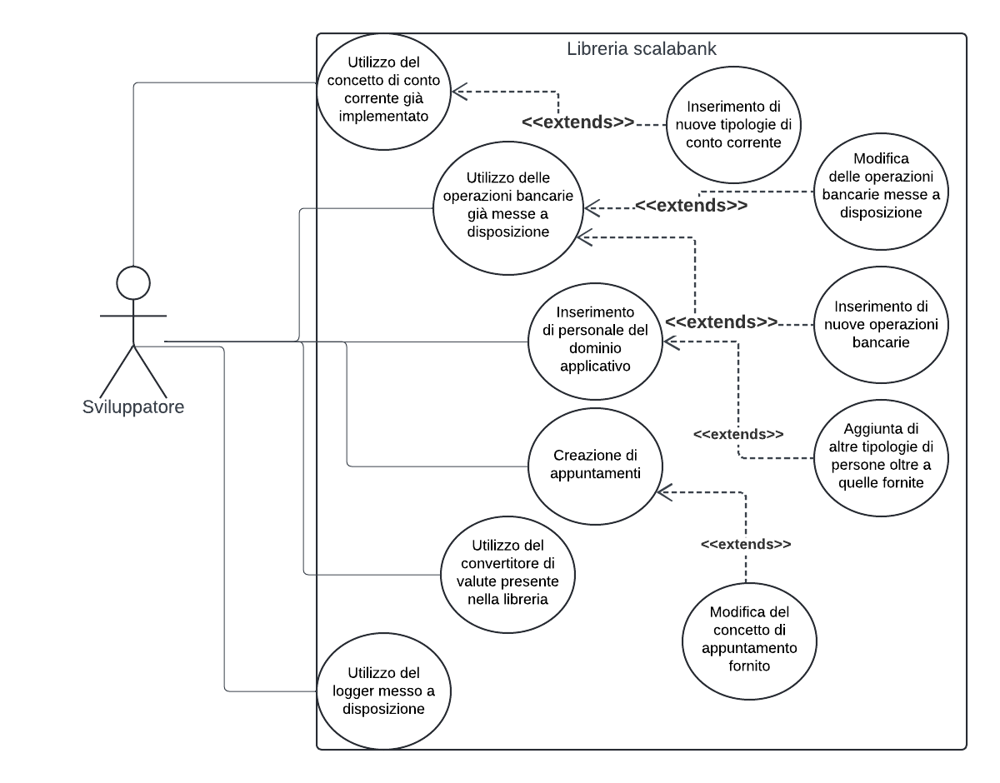

# REQUISITI E SPECIFICA DEL SISTEMA
Nel presente capitolo sono riportati, suddivisi ed enumerati i requisiti del sistema.

Si noti che, esattamente come prevede la filosofia su cui si basa Scrum, la presente sezione è il frutto di un lavoro iterativo e continuo: l'individuazione e definizione dei requisiti è da considerarsi come un processo più che come un prodotto, in ragione del fatto che i requisiti cambiano col tempo e l'avanzamento dello sviluppo consente di identificarne sempre di nuovi.

## Requisiti di business
Tentano di rispondere alla domanda riguardante il perchè il progetto ha avuto luogo: esprimono dunque come mai il software è ritenuto strategico, aiutano a definire quali sono gli obiettivi del progetto, le speranze del cliente e degli sviluppatori.

Aiutano inoltre a chiarire e stabilire come giudicare la buona riuscita del progetto.

Innanzitutto occorre evidenziare che il progetto è ritenuto strategico in quanto rappresenta un connubio fondamentale di diversi aspetti universitari: non solo esso è il mezzo attraverso il quale è possibile sostenere l'esame del corso di PPS, ma esso rappresenta anche una splendida occasione per mettersi alla prova e verificare ed approfondire la comprensione degli aspetti emersi durante le lezioni.

L'elenco seguente riporta i requisiti di business emersi:
- 1.1 il progetto prevede la creazione di un framework Scala completo utilizzabile per modellare e produrre applicazioni nel contesto bancario
- 1.2 le speranze del team di sviluppo, nonchè gli obiettivi prefissati per poter constatare la buona riuscita del progetto, sono la produzione della libreria in modo chiaro e pulito, non solo nel codice ma anche e soprattutto nella parte di progettazione e strutturazione dei moduli (anche seguendo i principi e best practice affrontate in classe).

## Requisiti riguardanti la modellazione del dominio
Lo sviluppo di una libreria, come facile immaginare, comporta la progettazione e modellazione di un vasto numero di entità presenti nel dominio di interesse.

Di seguito si riporta l'elenco dei requisiti riguardanti specificatamente la modellazione del dominio e delle sue entità:
- 2.1 modellazione del conto corrente ed alcune sue possibili varianti
- 2.2 rappresentazione delle persone del dominio, divise tra clienti e personale bancario
- 2.3 modellazione della nozione di appuntamenti tra clienti e impiegati bancari
- 2.4 rappresentazione del concetto di filiale, la cui tipologia (fisica o virtuale) impatta sulle modalità di appuntamento richiedibili
- 2.5 modellazione delle valute
- 2.6 modellazione di un generico salvadanaio, inteso come astrazione che regola una qualche strategia di risparmio automatica suggerita dalla banca.

## Requisiti funzionali per l'utente
I requisiti funzionali per l'utente si concentrano su quali sono le funzionalità che il sistema offre e che sono direttamente sfruttabili dall'utente finale.

Ricordiamo che il nostro progetto propone come utente finale/cliente un'entità piuttosto particolare: trattasi in generale di studenti, informatici o più in generale sviluppatori interessati ad utilizzare la nostra libreria per sviluppare una generica applicazione bancaria, sia essa realistica o puramente sperimentale/didattica.

Pertanto, nella stesura dei requisiti funzionali per l'utente (ma in realtà anche per altre tipologie di requisiti) è stato necessario mettersi nei panni dell'utente finale e cercare di individuare le sue aspettative ed i suoi bisogni.

Tale cambio di prospettiva è stato molto stimolante da attuare, siccome solitamente nei progetti precedenti (così come spesso accade nei prodotti reali) il cliente è esterno, propone dei requisiti che sì vanno compresi, disambiguati e spesso estrapolati in quanto non chiaramente identificabili, ma nel nostro caso, invece si è aggiunto un ulteriore livello di astrazione e dunque di difficoltà, in quanto si è reso necessario che il team di sviluppo si tramutasse in cliente, in modo da individuarne le necessità e i bisogni legati allo sviluppo della libreria e formalizzarli in un'indagine quanto più dettagliata e ben strutturata possibile.

L'elenco seguente riporta dunque quali requisiti funzionali per l'utente sono emersi durante la fase di analisi sopra menzionata:
- 3.1 l'utente può modellare, rappresentare, estendere e combinare a piacere tutte le entità rilevanti nel dominio d'interesse (e dunque riportate nella sezione precedente) &rarr; si noti che il soddisfacimento di tale requisito è di fondamentale importanza per valutare e verificare la qualità del prodotto finale, pertanto ad esso è strettamente correlato un ulteriore requisito funzionale di seguito riportato &rarr;
  - 3.1.1 il grado di malleabilità ed agilità con cui è possibile lavorare ed utilizzare la libreria implementata dev'essere valutato attraverso la realizzazione (incrementale) di un'interfaccia grafica che consenta di effettuare operazioni sia in veste di cliente che di impiegato bancario
- 3.2 l'utente può modellare e implementare le varianti di conto corrente che preferisce
- 3.3 l'utente può altresì modellare con agilità operazioni su singolo conto corrente (deposito, prelievo, visualizzazione saldo), così come operazioni tra più conti correnti (trasferimento di denaro)
- 3.4 l'utente può inserire personale del dominio (ovvero clienti e personale bancario) e verificarne tutte le informazioni salienti
- 3.5 all'utente finale è anche permesso aggiungere e verificare gli appuntamenti di un dato cliente
- 3.6 l'utente può modellare diverse tipologie di proposta di mutuo, verificare quali sono compatibili con il profilo di un dato cliente e creare così un prospetto che includa orizzonte temporale, importo complessivo, interessi e rata da pagare
- 3.7 per quanto concerne le valute, l'utente deve poter lavorare agilmente con la valuta che preferisce e potenzialmente dovrebbe anche essere messo nelle condizioni di lavorare con multiple valute nella medesima applicazione &rarr; l'operazione di conversione è pertanto ritenuta di fondamentale interesse
- 3.8 infine l'utente può sfruttare e consultare un logger, strumento fondamentale per la verifica di correttezza delle sue applicazioni in quanto tiene traccia e riporta in ordine esatto i principali eventi accaduti (inserimento di una persona, operazione su conto corrente, inserimento di un appuntamento...).

Per meglio comprendere i requisiti funzionali evidenziati, si faccia riferimento al diagramma dei casi d'uso sotto riportati:

## Requisiti non funzionali
I requisiti non funzionali coprono invece le qualità che è possibile attribuire al sistema. 

Per quanto riguarda la nostra libreria, i requisiti non funzionali individuati sono:
- 5.1 usabilità &rarr; come emerso anche in punti precedenti, è fondamentale che l'utilizzo del framework sia chiaro, semplice e comprensibile agli utenti finali
- 5.2 estendibilità del framework (intesa come semplicità di aggiunta di concetti, entità e funzionalità a quelle offerte inizialmente).

## Requisiti di implementazione
I principali vincoli di produzione sono:
- 6.1 implementazione dell'interfaccia grafica con le monadi
- 6.2 impiego di Scala come linguaggio di programmazione
- 6.2 utilizzo di Scalatest per testing, quanto più possibile sotto forma di Domain Specific Language.

[TORNA ALL'INDICE](../index.md) | 
[PRECEDENTE CAPITOLO](../2-development-process/index.md) | 
[PROSSIMO CAPITOLO](../4-architectural-design/index.md)