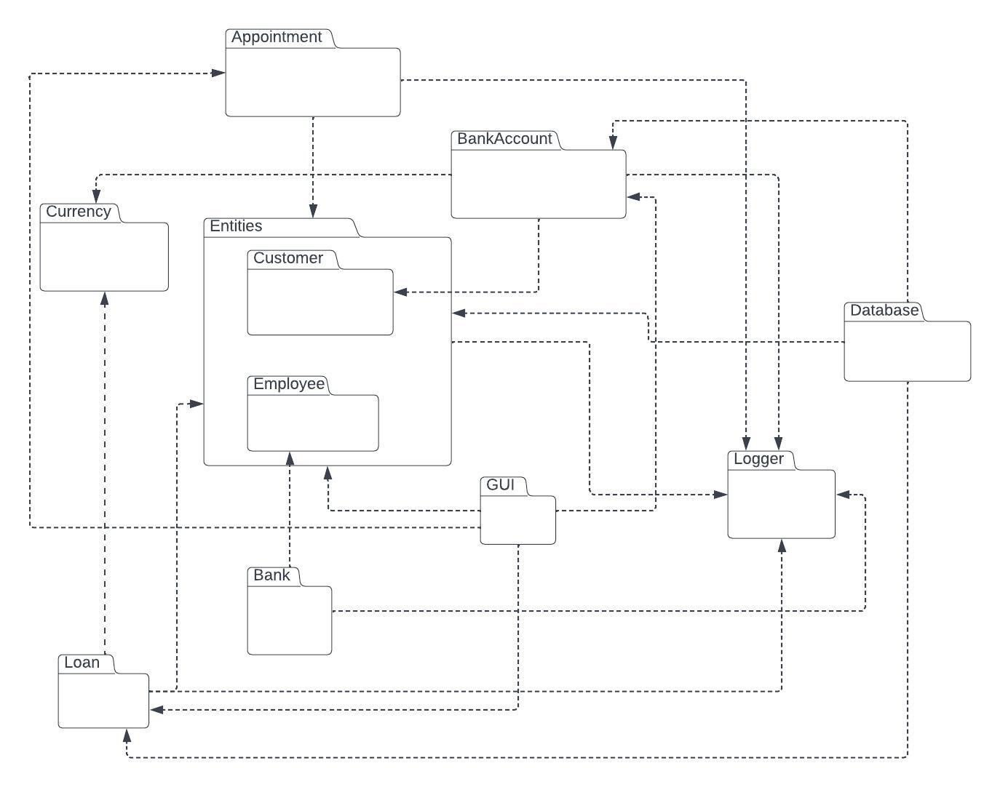

# Design Architetturale
<!--Design architetturale (architettura complessiva, descrizione di pattern architetturali usati, eventuali componenti del sistema distribuito, scelte tecnologiche cruciali ai fini architetturali -- corredato da pochi ma efficaci diagrammi)

Ricordate che una scelta architetturale può ritenersi giustificata o meno solo a fronte dei requirement che avete indicato; viceversa, ogni requirement "critico" dovrebbe influenzare qualcuna della scelte architetturali effettuate e descritte.
L'architettura (diagramma + spiegazione in prosa) deve spiegare quali sono i sotto-componenti del sistema (da 5 a 15, diciamo), ognuno cosa fa, chi interagisce con chi e scambiandosi quali dati -- i diagrammi aiutano, ma poi la prosa deve chiaramente indicare questi aspetti.-->

A seguito della fase di requirements engineering/analysis, è seguita la fase di design architetturale.

Essendo il progetto focalizzato sullo sviluppo di una libreria, ci è sembrato ragionevole produrre il design architetturale ragionando in termini dei package che dovranno essere creati.

Il diagramma dei package risultante da questa fase è consultabile nel seguito:

Si noti che il package diagram proposto rappresenta anche un'ottima linea guida che fornisce anche un'anticipazione di come sarà probabilmente strutturato il framework alla fine del progetto.

Nell'elenco che segue si descrivono un po' più in dettaglio i package che sonostati individuati:
- Entities &rarr; racchiude tutti concetti relativi alle persone che possono essere coinvolte in una banca (impiegati, clienti...)
- Bank &rarr; contiene tutte le classi legate alle filiali
- BankAccount &rarr; racchiude tutti concetti legati ai conti correnti e alle operazioni su loro ammissibili (prelievo, bonifico, deposito...)
- Currency &rarr; avrà un duplice scopo, non solo fornire funzioni di utilità per lavorare con monete e denaro, ma anche offrire funzioni di utilità per la conversione tra varie valute
- Loan &rarr; contiene tutte le classi legate alla simulazione di prestiti/mutui
- Appointment &rarr; conterrà la classe e le funzioni di utilità per gli appuntamenti tra clienti e personale bancario
- GUI &rarr; racchiude le classi necessarie per la realizzazione dell'interfaccia grafica
- Logger &rarr; contiene tutte le classi legate al logger, componente in grado di riportare ed elencare i principali eventi accaduti
- Database &rarr; package emerso successivamente rispetto agli altri, contiene tutti i file di utilità per salvare ed estrarre informazioni dal database.

Grazie al diagramma dei package prodotto durante la fase di design architetturale, è stato possibile per il team avere una vista complessiva e globale del progetto, in modo anche da poter meglio organizzare i vari sprint e suddividere equamente il lavoro tra i membri del gruppo.

[Back to index](../index.md) |
[Previous Chapter](../3-requirements/index.md) |
[Next Chapter](../5-detailed-design/index.md)