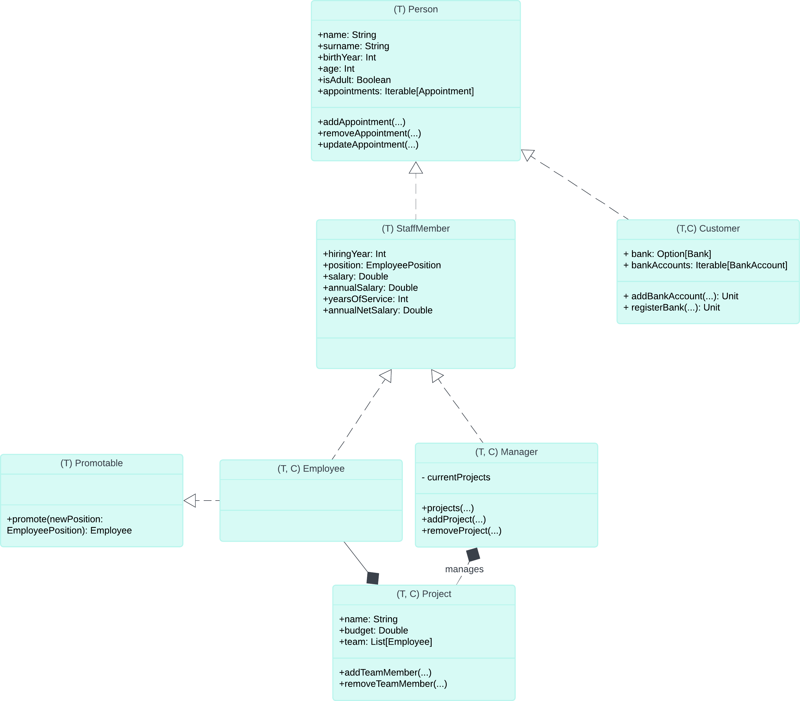
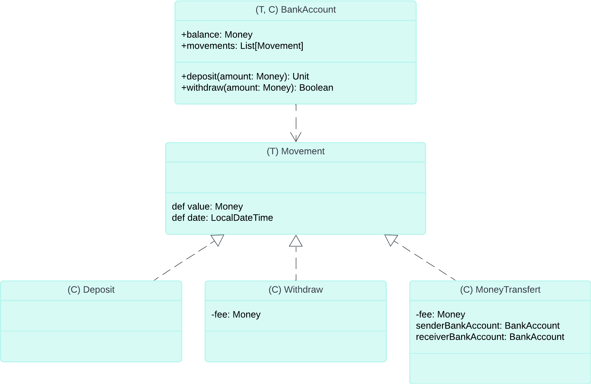
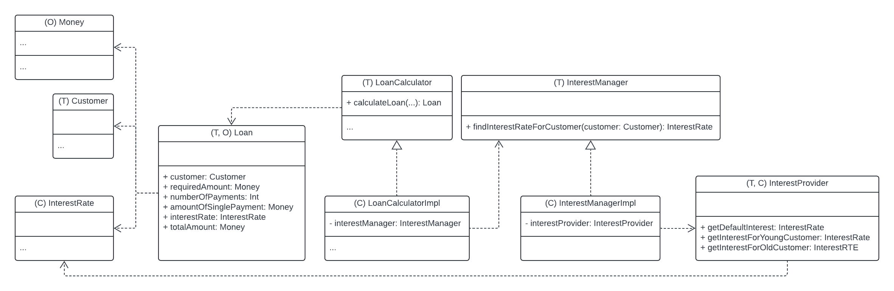
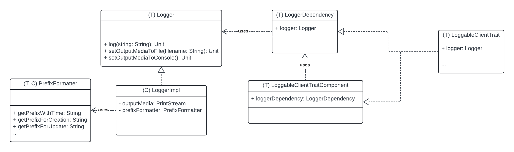
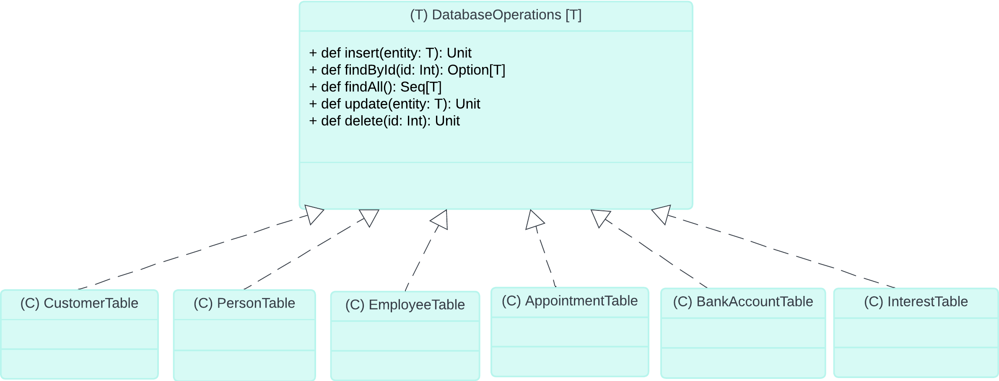
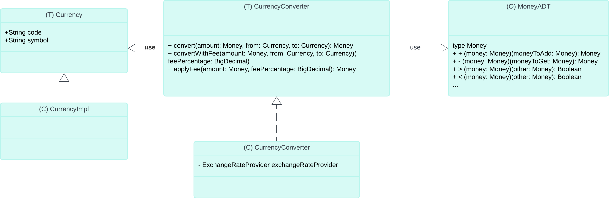

# Design di dettaglio
<!--Design di dettaglio (scelte rilevanti, pattern di progettazione, organizzazione del codice -- corredato da pochi ma efficaci diagrammi)
l design di dettaglio "esplode" (dettaglia) l'architettura, ma viene concettualmente prima dell'implementazione, quindi non metteteci diagrammi ultra-dettagliati estratti dal codice, quelli vanno nella parte di implementazione eventualmente.-->
Nel design di dettaglio, per far emergere le scelte rilevanti e l'organizzazione del codice, si è ritenuto ragionevole produrre alcuni diagrammi delle classi UML a partire dal diagramma dei package prodotto nella sezione precedente di design architetturale.

Nelle sezioni che seguono vengono dunque riportati e descritti i diagrammi prodotti.

## Design di dettaglio delle persone coinvolte nell'ambito bancario
Come emerso anche nel diagramma dei package prodotto nella fase di design architetturale, le varie persone coinvolte nel contesto bancario possono essere rifinite e descritte con maggiore precisione grazie al seguente diagramma delle classi UML:

I componenti che compongono il package entities sono dunque:
- il trait Person contenente dei campi pubblici per tutti i suoi dati anagrafici rilevanti &rarr; tale trait rappresenta la superclasse di una gerarchia che comprende i sottotrait StaffMember e Customer
- il trait Customer rappresenta la specializzazione di Person atta a rappresentare i clienti
- invece il trait StaffMember rappresenta la specializzazione di Person che rappresenta gli impiegati bancari &rarr; si noti tra le altre cose che tale trait ha dei metodi e campi per lavorare con gli appuntamenti e che è la superclasse di un'altra gerarchia che comprende i sottotrait Manager ed Employee
- esiste poi anche il trait Promotable, per esprimere che è possibile che un Employee venga promosso ad una nuova posizione
- esiste infine anche il trait+implementazione Project che esprime in quali progetti è impegnato ciascun membro dello staff &rarr; si noti che ogni progetto ha un manager come supervisore e una lista di impiegati coinvolti.

## Design di dettaglio delle operaizoni bancarie
Per soddisfare i requisiti emersi nella fase di analisi riguardanti le operazioni bancarie è stato progettato il seguente diagramma delle classi:

Dallo schema si nota che abbiamo ritenuto ragionevole inserire anche un trait comune Movement che racchiudesse tutti gli aspetti condivisi tra tali operazioni bancarie.

Da un bank account possono pertanto essere fatti principalmente tre tipi di movimenti:
- deposito
- prelievo
- bonifico/trasferimento di denaro tra conti.

Si noti infine che il conto corrente tiene traccia di tutti i suoi movimenti, grazie ad un campo collezione movements, in modo da poter offire al cliente anche un estratto conto delle sue operazioni.

## Design di dettaglio della simulazione di mutui
Un ulteriore requisito emerso durante la fase di requirements/engineering analysis è stata la possibilità di simulare mutui/prestiti: un cliente può dunque simulare la richiesta di un prestito di un quantitativo di denaro di cui necessita per sapere informazioni utili quali il tasso d'interesse applicato, il numero di pagamenti previsti, l'ammontare del singolo pagamento e quanto dovrà sborsare per ripagare il debito (somma tra cifra richiesta ed interessi applicati).

Si noti che gli interessi applicati, come spesso accade nella realtà, si basano fortemente su alcuni parametri del cliente: nel nostro caso sono strettamente legati alla sua età ma, come si nota anche dal diagramma sotto riportato, è possibile separare bene le varie responsabilità in componenti diversi per generalizzare questo aspetto e renderlo facilmente modificabile (rispetto dei principi di SRP, modularità ed AOC) in modo che si adatti a qualsivoglia strategia diversa (ad esempio molto comune nell'ambito dei prestiti è anche calcolare il tasso d'interesse da applicare in base all'orizzonte temporale con cui il cliente desidera ripagare il debito contratto).

I componenti presenti sono dunque:
- LoanCalculator è il trait che mette a disposizione il metodo calculateLoan() per calcolare un mutuo/prestito
- LoanCalculatorImpl è la classe che implementa il trait sopra descritto &rarr; si noti che essa contiene un campo privato dedicato all'InterestManager
- il trait InterestManager offre un metodo findInterestRateForCustomer() in grado di individuare il più adatto tasso d'interesse per un cliente &rarr; il fatto di aver spostato tale responsabilità in un trait agevola di molto l'estendibilità della libreria, in quanto basterebbe solo agire su questa limitata parte del codice per modificare la strategie con cui si individua il corretto tasso d'interesse da applicare (ad esempio per renderlo dipendente non più dal cliente ma dall'orizzonte temporale)
- la classe InterestManagerImpl dovrà però avere un campo dedicato ad un altro componente noto come InterestProvider, il quale contiene il valore di tutti i vari tassi d'interesse disponibili &rarr; tale trait+classe può essere vista come una sorta di container che mette a disposizione (magari previa interrogazione di database) tutti i tassi d'interesse possibili
- il trait Loan, che è anche il tipo di ritorno del metodo calculateLoan() del trait LoanCalculator, rappresenta come suggerisce il nome un prestituo/mutuo, dunque conterrà dei metodi per interagire con vari parametri rilevanti come il numero di rate o l'ammontare di una rata
- il trait Loan, per funzionare correttamente, necessita di interagire con altre componenti della libreria quali Money (per rappresentare valori e quantità monetarie al posto di Int, evitando di fatto la primitive type obsession), Customer e InterestRate.
## Design di dettaglio del logger
Il design dettagliato del logger ha subito numerose ristrutturazioni incrementali durante tutta la fase di design, siccome partendo dalla soluzione più facile ci si è resi conto che tale componente poteva essere ulteriormente rifinito per applicarvi pattern di progettazione e principi (descritti più dettagliatamente nel capitolo dedicato all'implementazione).

- Il componente principale è il trait Logger, che offre (come suggerisce il nome) tutte le funzionalità di logging &rarr; si noti che alcuni metodi del Logger riguardano l'output media, inteso come mezzo su cui verranno stampati gli eventi &rarr; sebbene di solito tale medium sia la console, ci è sembrato ragionevole renderlo mutabile, in modo da favorire l'estendibilità del framework e rendere meno rigida la libreria, rispettando al contempo il principio DIP (abbiamo reso il Logger dipendente non più direttamente dalla console concreta ma dalla sua astrazione OutputMedia)
- Il trait Logger è implementato grazie alla classe LoggerImpl, che tra l'altro ha un campo di tipo PrefixFormatter &rarr; ciò è stato fatto siccome per rispettare il principio SRP si è dovuto spostare all'esterno del Logger la responsabilità dei prefissi (similmente a quanto visto a lezione)
- Il trait+classe PrefixFormatter è infatti il componente responsabile di offrire i prefissi secondo necessità (sicuramente occerrerà che esso possegga un prefisso rappresentante il momento temporale attuale ed un prefisso dedicato alla creazione di nuove entità come persone, conti, impiegati ecc.).

Invece i tre trait rappresentati nella parte destra del diagramma UML sono necessari in quanto, sempre dopo dei raffinamenti incrementali, è emerso che per gestire in modo più corretto le dipendenze verso il logger sarebbe molto utile applicare il cake pattern presentatoci alla fine del corso.

Il cake pattern è un pattern funzionale fondamentale per gestire correttamente le dipendenze ed ottenere dei componenti più flessibili e che rispettino meglio la modularità.

Per meglio comprendere i dettagli di come sarà implementato il cake pattern si rimanda alla relativa sezione nel capitolo dedicato all'implementazione, tuttavia già dal design emerge la necessità di avere:
- un trait LoggerDependency che rappresenta la dipendenza esposta ed offerta dal logger
- ed un trait ClientComponent che specifica la dipendenza tra il logger e la classe client (colei che necessita del logger per stampare qualcosa).

Infine, come si nota anche dal diagramma, la classe client dovrà estendere entrambi i trait sopra riportati, in modo appunto da specificare l'implementazione concreta del logger di cui necessita.

Già dal design sono emerse diverse classi client che potrebbero avere bisogno del logger: Customer, Employee, Manager, Loan, BankAccount e BankOperation.

## Design di dettaglio del database
Il database è un componente che inizialmente non avevamo previsto di inserire nel nostro progetto, tuttavia è subito emersa la necessità di adottarlo a causa dei seguenti vantaggi:
- presenza di dati iniziali utili per la GUI &rarr; senza un database ogni volta che si apre la GUI occorre inserire un sacco di istanze manualmente (diversi clienti, diversi impiegati, assegnare conti a clienti...)
- persistenza &rarr; è comodo mantenere/salvare i dati inseriti, in modo che rimangano presenti nell'applicazione nonostante la chiusura della stessa
- facilità di estrazione di dati e parametri utili &rarr; salvando sul database parametri come interessi, fee, tasse e costi si evita di scriverli direttamente nel codice, rendendo la libreria meno rigida.

Il diagramma delle classi UML progettate per creare il database è il seguente:

Dal diagramma emergono i seguenti componenti:
- il trait DatabaseOperations rappresenta una generica tabella presente nel database e le operazioni effettuabili sulle sue righe (inserimento, ricerca, modifica ed eliminazione) &rarr; si noti che tale trait è generico nel tipo T, che specifica il tipo delle entità che popolano la tabella in questione
- esistono poi diverse classi che rappresentano le diverse implementazioni possibili del trait Databaseoperations sopra riportato, che possono essere viste come le differenti tabelle presenti sul database (sicuramente serviranno una tabella per i clienti, una per le  persone, una per gli impiegati, una per gli appuntamenti, una per i conti bancari e una per i tassi d'interesse).

## Design di dettaglio della conversione di valute
Uno dei requisiti emersi in fase di requirements/engineering analysis è offrire funzionalità utili alla conversione di valute, ossia predisporre funzionalità che consentano di effettuare un cambio tra il valore di una moneta e l'equivalente valore di un'altra differente moneta.

Come si nota dal diagramma seguente, i componenti necessari alla conversione di valuta sono diversi:

- Il trait CurrencyConverter è il convertitore vero e proprio, ovvero il responsabile principale delle funzionalità di conversione di un ammontare di denaro da una valuta ad un'altra &rarr; tra i suoi metodi compaiono anche convertWithFee (per rappresentare che la conversione potrebbe comportare il pagamento di una tassa) ed applyFee che consente di calcolare il valore del denaro dopo l'applicazione della tassa di conversione
- La classe CurrencyConverter è l'implementazione del trait sopra descritto &rarr; si noti che esso contiene tra le altre cose anche un campo privato ExchangeRateProvider che permetterà in qualche modo la conversione di valuta
- Il trait CurrencyConverter usa il trait Currency, che è un'astrazione rappresentante una valuta, con campi simbolo (tipo $, £,..) e codice ufficiale
- La classe CurrencyImpl è l'implementazione del trait sopra descritto
- Infine è presente un object MoneyADT, che mette a disposizione tutte le funzionalità utili a lavorare in modo corretto con valori e quantità monetarie.

[Back to index](../index.md) |
[Previous Chapter](../4-architectural-design/index.md) |
[Next Chapter](../6-implementation/index.md)