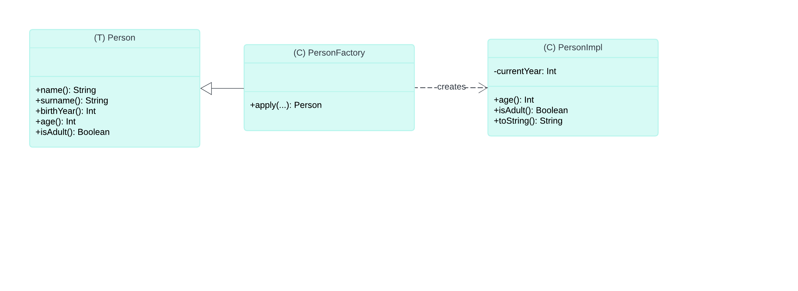
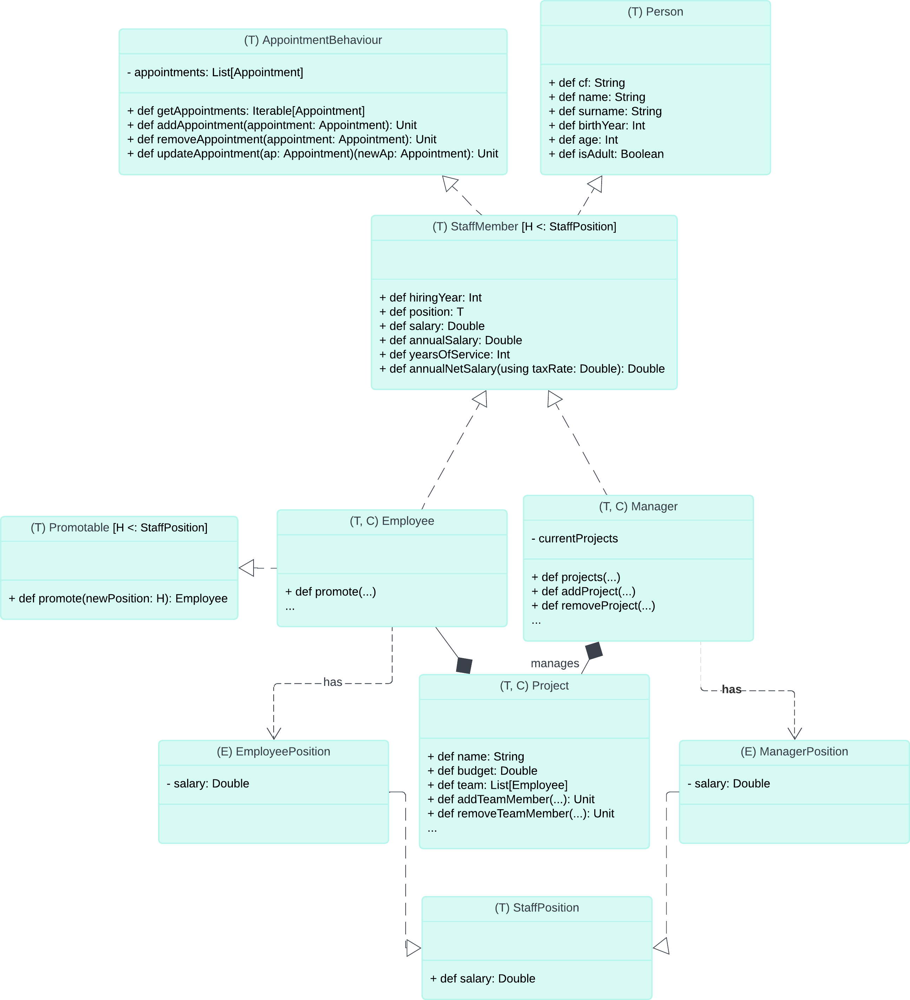
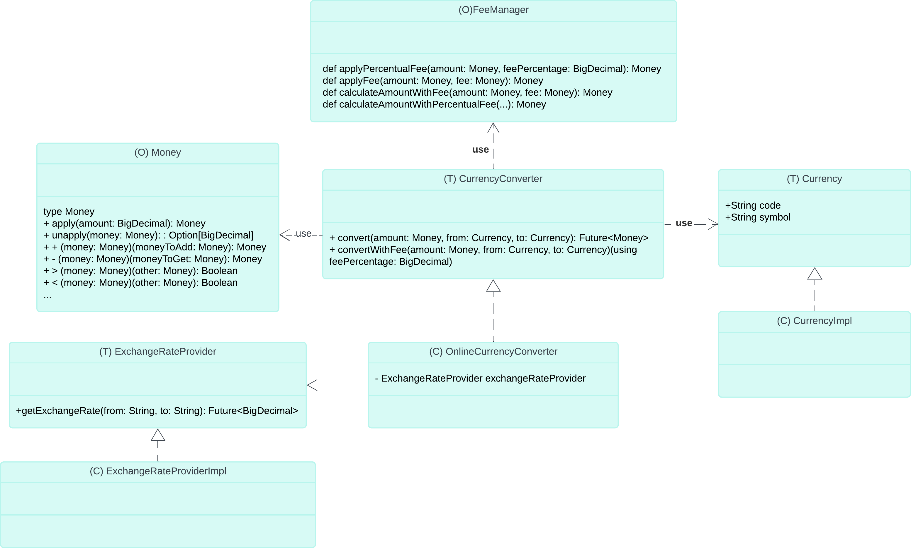
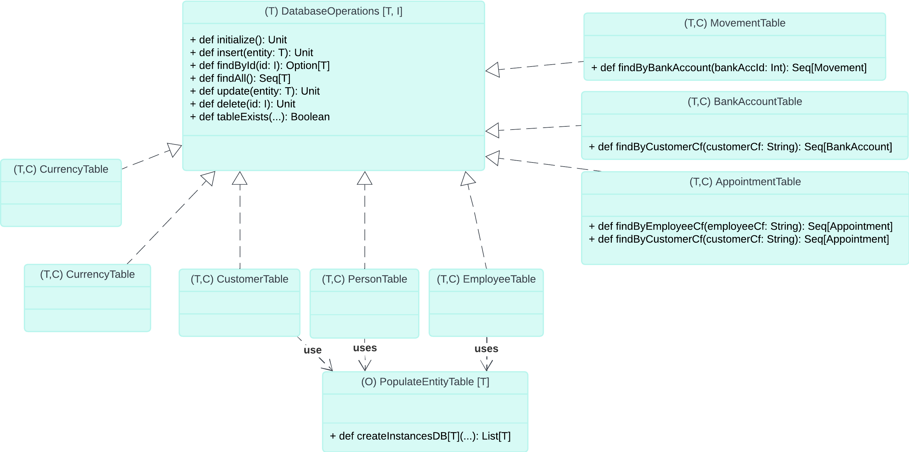

# Documentazione Implementativa

Nella prima parte mi sono occupato dello staff della banca in particolare, una volta creata la classe Persona in collaborazione con Mazzotti, sono passato a modellare le varie entità presenti nel contesto bancario.

## Parte 1

## Struttura generale

In particolare si è deciso di utilizzare il pattern factory per le se seguenti classi: `Person`, `Employee`, `Manager`, `Project`.
Riporto lo schema UML per la factory della persona.



Invece è stato utilizzato un template method per quanto concerne la gestione delle diverse tipologie di dipendenti. In particolare è stata creata prima l'interfaccia `StaffPosition` la quale è un mixin, il quale contiene implementati i metodi comuni ed estende Person. A questo punto le classi `Employee` e `Manager` estendono `StaffPosition`.
Riporto lo schema UML per il template method della gestione dei dipendenti. Si noti che (T) è un trait, (C) è una classe, (T, C) vuol dire che è stato creato il trait e la classe relativa utilizzando il pattern factory come descritto sopra per la classe `Persona`.



Ora riporto una sintetica descrizione delle classi:

### Person

Il trait `Person` rappresenta una persona con informazioni di base e relativi comportamenti.

#### Meccanismi utilizzati:

- **Validazione:** Controllo che l'anno di nascita non sia nel futuro con require.
- **Factory Method:** Metodo `apply` per creare istanze di `Person` con la case class `PersonImpl`.
- **Extension Methods** Per definire i metodi `isYoungerThan` e `ageDifference`.

### StaffMember

Il trait `StaffMember` rappresenta un membro dello staff con dettagli sulla posizione e metodi per calcolare i salari e gestire gli appuntamenti.
Essendo un mixin esso fornisce funzionalità comuni a tutti i membri dello staff. È un'implementazione generica che utilizza un parametro di tipo `T` che estende `StaffPosition`. 
Questa classe eredita da `Person`.

#### Meccanismi utilizzati:

- **Generics:** Utilizzo di generics al fine di poter generalizzare la posizione lavorativa di uno `StaffMember`, la quale si differenzia a seconda della tipologia di impiegato.
- **Bounded type parameter** Utilizzo di bounded type parameter `[T <: StaffPosition]`. Più specificamente un upper bound, in cui T è un parametro di tipo che può essere sostituito con qualsiasi tipo che sia un sottotipo di StaffPosition. In questo modo limito i tipi di position.
- **Mixin** Il trait avendo sia metodi implementati che non è un mixin.
- **Currying** Per il passaggio di valori in `updateAppointment`.
- **List** Per la lista è stato deciso di usare una lista immutabile, usando una var.


### Employee

Il trait `Employee` rappresenta un dipendente che estende `AbstractStaffMember` con una specifica posizione lavorativa (`EmployeePosition`) e con possibilità di promozione con (`Promotable[EmployeePosition]`).

#### Meccanismi utilizzati:

- **Enumerazione:** `EmployeePosition` è un'enumerazione che definisce diverse posizioni e i relativi salari.
- **Givens:** L'uso di `given` per definire i tassi di bonus standard e senior e il tasso di imposta predefinito.
- **Factory Method:** Metodo `apply` per creare istanze di `Employee` con la case class `EmployeeImpl`.
- **For-yield** Utilizzo di for-yield per i metodi `allEmployeesSalary` e `totalAnnualSalary`.
- **Export** Utilizzo della delegazione su un oggetto `Person`.

### Manager

Il trait `Manager` rappresenta un manager e fornisce funzionalità aggiuntive per la gestione dei progetti.

#### Funzionalità Principali:

- **Gestione dei Progetti:** Metodi per ottenere (`projects`), aggiungere (`addProject`) e rimuovere (`removeProject`) progetti.
- **Calcoli sui Progetti:** Metodi estesi per ottenere il budget di un progetto specifico (`projectBudget`) e il budget totale di tutti i progetti (`totalProjectBudgets`).

#### Meccanismi utilizzati:

- **Enumerazione:** `ManagerPosition` è un'enumerazione che definisce diverse posizioni manageriali e i relativi salari.
- **Factory Method:** Metodo `apply` per creare istanze di `Manager` con la case class `ManagerImpl`.
- **Extension Methods** Per definire i metodi `projectBudget` e `totalProjectBudgets` su un manager e `totalProjectsManaged` su una lista di manager.
- **Tail_recursion** Per calcolare `totalProjectsManaged` per contre il numero di progetti fra tutti i manager.
- **Export** Utilizzo della delegazione su un oggetto `Person`.

### Project

Il trait `Project` rappresenta un progetto con un nome, un budget e un team di lavoro.


### StaffPosition

Il trait `StaffPosition` rappresenta una posizione occupata da un membro dello staff con il relativo salario.

## Parte 2

In questa parte, descriveremo l'implementazione dei file all'interno del package `scalabank.currency`. Ho utilizzato i principi KISS (Keep It Simple, Stupid) e DRY (Don't Repeat Yourself) per mantenere il codice semplice, leggibile e riutilizzabile. Inoltre, sono stati applicati vari pattern di progettazione per migliorare la struttura e la manutenibilità del codice.



### Currency

Il trait `Currency` rappresenta una valuta con un codice e un simbolo.

#### Meccanismi utilizzati:

- **Encapsulation:** Uso di metodi per accedere agli attributi `code` e `symbol`.
- **Factory Method:** Metodo `apply` per creare istanze di `Currency` con la case class privata `CurrencyImpl`.

### CurrencyConverter

Il trait `CurrencyConverter` rappresenta un convertitore di valute con metodi per la conversione e l'applicazione di commissioni. Per la realizzazione, ho utilizzato un'API esterna interrogando il server di YAHOO, al fine di avere ogni volta i dati aggiornati delle valute.

#### Meccanismi utilizzati:

- **Asynchronous Programming:** Uso di `Future` per operazioni asincrone.
- **Factory Method:** Metodo `apply` per creare istanze di `CurrencyConverter` con la case class `OnlineCurrencyConverter`.

### ExchangeRateProvider

Il trait `ExchangeRateProvider` rappresenta un provider di tassi di cambio. Ho dovuto appoggiarmi a una classe diversa perché la risposta del server di YAHOO richiede la scomposizione della risposta attraverso una libreria apposita per formati JSON. Per questo motivo è nata questa classe, in modo da rispettare i principi DRY e SRP. Essa scompone la richiesta e restituisce il valore richiesto.

#### Meccanismi utilizzati:

- **Asynchronous Programming:** Uso di `Future` per operazioni asincrone.
- **Encapsulation:** Metodi privati per ottenere e parsare i tassi di cambio.
- **For-yield:** Al fine di scomporre il JSON arrivato.

### MoneyADT

L'oggetto `MoneyADT` rappresenta un modo sicuro e flessibile per lavorare con valori monetari. Questo approccio limita le operazioni consentite sul denaro, garantendo maggiore sicurezza e integrità dei dati finanziari.

#### Meccanismi utilizzati:

- **Type Safety:** Uso di un tipo opaco (`opaque type`) per rappresentare una quantità di denaro in modo sicuro, prevenendo operazioni errate che potrebbero compromettere l'integrità dei dati.
- **Extension Methods:** Metodi di estensione per operazioni aritmetiche e formattazione, limitando le operazioni possibili a quelle definite, migliorando la leggibilità del codice e riducendo gli errori.
- **Immutabilità:** Le istanze di `Money` sono immutabili, garantendo che il valore del denaro non possa essere modificato una volta creato.
- **Validazione dei dati:** Controlli per garantire che le quantità di denaro siano non negative, evitando errori logici nell'uso delle cifre.

#### Descrizione del codice

Il codice presentato definisce l'ADT `Money` utilizzando un tipo opaco, che nasconde l'implementazione interna (un `BigDecimal`) e fornisce un'interfaccia sicura e controllata per le operazioni sul denaro. Ecco una panoramica delle componenti principali:

##### Estrazione del valore
```scala
def unapply(money: Money): Option[BigDecimal] = Some(money)
```
Questo metodo permette di estrarre il valore interno di un'istanza di Money come BigDecimal.

##### Conversione da tipi di dati comuni a Money
```scala
extension (amount: Double | Int | Float | String | BigDecimal)
  def toMoney: Money = ...
```
Questa estensione permette di creare istanze di Money da vari tipi di dati, assicurando che il valore sia non negativo.

##### Operazioni aritmetiche e di confronto
```scala
extension (money: Money)
def +(moneyToAdd: Money): Money = money + moneyToAdd
def -(moneyToGet: Money): Money = money - moneyToGet
...
def *(factor: BigDecimal): Money = money * factor
def /(factor: BigDecimal): Money = money / factor
```
Queste estensioni definiscono le operazioni aritmetiche (addizione, sottrazione, moltiplicazione, divisione) e di confronto (maggiore, minore, ecc.) su istanze di Money.

##### Ordinamento

Questa implementazione permette di ordinare istanze di `Money` in collezioni ordinate (`SortedSet`, `SortedMap`) o utilizzare funzioni di ordinamento (`sorted`, `max`, `min`) in modo naturale, grazie alla definizione implicita dell'ordine.
La dichiarazione:

```scala
given Ordering[Money] with
override def compare(x: Money, y: Money): Int = x.compare(y)
```

#### Meccanismi utilizzati:

- **Type Safety:** Uso di un tipo opaco per rappresentare in modo sicuro una quantità di denaro.
- **Extension Methods:** Metodi di estensione per operazioni aritmetiche e formattazione, al fine di limitare le operazioni possibili.

### Principi KISS e DRY

- **KISS (Keep It Simple, Stupid):** Ho mantenuto il codice semplice e leggibile, evitando complessità inutili. Ad esempio, l'uso di `Future` per operazioni asincrone semplifica la gestione delle chiamate di rete.
- **DRY (Don't Repeat Yourself):** Ho evitato la duplicazione del codice utilizzando metodi di estensione e case class private per implementazioni specifiche. Ad esempio, i metodi di estensione per `Money` prevengono la duplicazione di logica comune.

### Pattern di Progettazione

- **Factory Method:** Usato per creare istanze di `Currency`, `CurrencyConverter` e `ExchangeRateProvider`.
- **Type Opacity:** Usato per il tipo `Money` per garantire la sicurezza dei tipi.
- **Asynchronous Programming:** Uso di `Future` per operazioni di rete non bloccanti.
- **Encapsulation:** Uso di metodi privati e case class per nascondere i dettagli di implementazione e fornire un'interfaccia pulita.

## Parte 3

### Struttura del Database

- **Creazione del Database:** Se le tabelle non esistono, vengono create e popolate con alcuni elementi, alcuni dei quali generati in modo randomico.
- **Istanziazione del Database:** La classe `Database` è istanziabile con diversi URL, permettendo l'utilizzo di un database temporaneo per i test e di un database persistente per l'uso normale del programma.
- **Riutilizzo del Codice:** Le operazioni comuni alle varie tabelle seguono il principio CRUD (Create, Read, Update, Delete) e implementano tutte lo stesso trait, garantendo un'implementazione consistente e riutilizzabile.
- **Utilizzo di Generics:** I generici sono ampiamente utilizzati per evitare la ripetizione del codice, migliorando la manutenibilità e la flessibilità del sistema. In particolare nelle classi: `DatabaseOperations` e `PopulateEntityTable`



### Principi di Buona Programmazione

- **Single Responsibility Principle:** Ogni classe è responsabile di un singolo compito, come la gestione di una specifica tabella del database.
- **Open/Closed Principle:** Il codice è strutturato in modo che le nuove funzionalità possano essere aggiunte senza modificare il codice esistente.
- **Liskov Substitution Principle:** Le classi derivate possono essere sostituite alle loro basi senza alterare il funzionamento del programma.
- **Interface Segregation Principle:** Le interfacce sono specifiche per ogni tipo di entità, evitando metodi non necessari.

### Implementazione

#### Trait `Database`
L'interfaccia `Database` definisce le tabelle principali:
```scala
trait Database:
  def personTable: PersonTable
  def employeeTable: EmployeeTable
  def customerTable: CustomerTable
  def appointmentTable: AppointmentTable
  def bankAccountTable: BankAccountTable
```

#### Trait `DatabaseOperations`

- Definisce le operazioni CRUD comuni a tutte le tabelle.
- Metodo `tableExists` per verificare l'esistenza di una tabella.

```scala
trait DatabaseOperations[T, Q]:
    def insert(entity: T): Unit
    def findById(id: Q): Option[T]
    def findAll(): Seq[T]
    def update(entity: T): Unit
    def delete(id: Q): Unit
    def tableExists(tableName: String, connection: Connection): Boolean =
      val statement = connection.createStatement
      try
        val query = s"SELECT * FROM INFORMATION_SCHEMA.TABLES WHERE TABLE_NAME = '$tableName'"
        val resultSet: ResultSet = statement.executeQuery(query)
        resultSet.next
      finally
        statement.close()
```

#### Classe `PersonTable`

- Crea e popola la tabella `person` se non esiste.
- Implementa le operazioni CRUD per la tabella `person`.

#### Classe `EmployeeTable`

- Crea e popola la tabella `employee` se non esiste.
- Implementa le operazioni CRUD per la tabella `employee`.

#### Classe `CustomerTable`

- Crea e popola la tabella `customer` se non esiste.
- Implementa le operazioni CRUD per la tabella `customer`.

#### Classe `BankAccountTable`

- Crea e popola la tabella `bankAccount` se non esiste.
- Implementa le operazioni CRUD per la tabella `bankAccount`.

#### Classe `AppointmentTable`

- Crea e popola la tabella `appointment` se non esiste.
- Implementa le operazioni CRUD per la tabella `appointment`.
- Fornisce metodi per trovare appuntamenti per codice fiscale di cliente o dipendente.

# Popolamento delle Tabelle

- **Random Data Generation:** La classe `PopulateEntityTable` crea istanze casuali per popolare le tabelle inizialmente, migliorando il testing e la simulazione di scenari realistici.


Per tutte le seguenti implementazioni si è deciso di utilizzare un approccio TDD.
Il Test-Driven Development (TDD) è una metodologia di sviluppo software in cui i test automatizzati vengono scritti prima del codice funzionale. 
In particolare si è si è adottato il Red-Green-Refactor.
* Red: Scrivi un test che fallisce (red).
* Green: Scrivi il codice minimo per far passare il test (green).
* Refactor: Migliora il codice mantenendo tutti i test verdi.