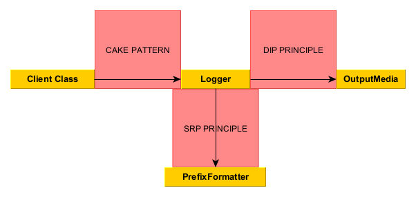

# DOCUMENTAZIONE IMPLEMENTATIVA NOTARO
Le mie principali responsabilità sono state:
- sviluppo del logger e gestione delle sue dipendenze
- modellazione dei mutui e loro simulazione
- modellazione e gestione di trasferimenti tra conti correnti (bonifici).

Nelle sezioni seguenti sono riportati e descritti gli aspetti implementativi ritenuti rilevanti per ogni compito da me svolto.

## Sviluppo del logger
Come anticipato nelle sezioni precedenti, lo sviluppo corretto di un logger può apparire un compito semplice e banale, tuttavia esso può risultare stimolante e più profondo di quanto appare se ci si pone come obiettivo quello di migliorare la gestione delle sue dipendenze e progettarlo seguendo quanto più possibile i principi di buona progettazione.

Il logger infatti, come mostrato anche più volte durante il corso, offre l'opportunità di misurarsi con aspetti non banali, relativi soprattutto all'applicazione di principi di buona progettazione del software e design pattern avanzati.

In particolare, il logger da me sviluppato mi ha dato l'opportunità di ragionare e lavorare sui seguenti aspetti:
- applicazione del cake pattern relativamente alla corretta gestione delle dipendenze delle classi client che utilizzano il logger
- applicazione del principio SRP relativamente alla gestione dei prefissi
- applicazione del principio DIP relativamente alla scelta del medium output.


Nella figura seguente è riportato uno schema riassuntivo che riporta gli aspetti implementativi rilevanti applicati al logger:


Come suggerito dalla metodologia di sviluppo, anche lo sviluppo del logger ha seguito un processo incrementale e basato sul TDD.

La primissima versione del logger, infatti, era stata implementata come singleton, il che portava sicuramente a:
- vantaggi &rarr; semplicità di accesso da parte delle classi client ed inizializzazione centralizzata dei suoi attributi
- svantaggi &rarr; difficoltà nella gestione dinamiche delle sue configurazioni, rischio di eventuali dipendenza nascoste e scalabilità limitata.

### Applicazione del cake pattern
Visti tali svantaggi, è stato ritenuto opportuno passare ad una versione del logger che sfruttasse il pattern funzionale cake pattern.

Il cake pattern è un pattern funzionale in Scala che viene utilizzato per la corretta gestione delle dipendenze e la composizione dei moduli in modo più flessibile e modulare. 

Questo pattern sfrutta i mixin e i trait di Scala per risolvere in modo più elegante e flessibile il problema delle dipendenze evitando di dover utilizzare dipendenze esplicite o pattern Singleton.

I concetti chiave di tale pattern sono:
- traits per moduli &rarr; ogni modulo viene definito come trait
- self-type annotations &rarr; queste annotazioni permettono a un trait di dichiarare che deve essere mischiato (mixed-in) con un altro trait, esprimendo dunque una dipendenza
- composizione tramite mixins &rarr; i moduli vengono composti insieme utilizzando i mixin, creando istanze concrete che soddisfino tutte le dipendenze necessarie.

Di seguito viene mostrata l'implementazione del cake pattern al logger:
```
trait Logger:  // Trait defining the Logger functionality.
  ...
  def log(string: String): Unit

trait LoggerDependency:  // Trait for classes that depend on a Logger (cake pattern).
  val logger: Logger

class LoggerImpl extends Logger:  // Implementation of the Logger trait.
  ...
  def log(string: String): Unit =
    if isEnabled then outputMedia.println(prefixFormatter.getPrefixWithCurrentTime + string)
```
Vediamo poi come dev'essere implementata e strutturata una classe client per poter utilizzare le funzionalità offerte dal logger:
```
trait Employee

trait EmployeeComponent:
  loggerDependency: LoggerDependency =>  // Explicit dependency between EmployeeComponent and LoggerDependency.
  case class EmployeeImpl(...) extends Employee:
    ...
    loggerDependency.logger.log(logger.getPrefixFormatter().getCreationPrefix + this)
    ...

// The object Employee extends both LoggerDependency and EmployeeComponent, providing also an implementation of the logger.
object Employee extends LoggerDependency with EmployeeComponent:
  override val logger: Logger = LoggerImpl()
  def apply(...): Employee = ...
```
Nel codice fornito si può notare come è stato applicato il cake patter tra `Logger` e `Employee` per gestire correttamente le dipendenze.

I componenti interessati dal pattern sono dunque:
- `LoggerDependency` &rarr; è il trait che rappresenta la dipendenze esposta, offerta dal logger
- `EmployeeComponent` &rarr; è il trait che definisce la struttura di `Employee` e contestualmente specifica che esso dipende da `LoggerDependency`
- `ObjectEmployee` combina dunque `LoggerDependency` ed `EmployeeComponent`, fornendo anche un'implementazione concreta del logger.

Come anticipato questa strategia, sebbene risulti più complessa da implementare e comprendere, offre notevoli vantaggi in termini di gestione delle dipendenze (esse sono chiaramente definite, migliorando di fatto anche la modularità) e separazione dei ruoli (la logica dell'impiegato risulta separata dalla logica del logger, pur dipendendone).

### Applicazione principio SRP per gestione prefissi
Il principio SRP suggerisce che un componente dovrebbe avere un unico motivo per cambiare.

Come conseguenza di ciò, occorre incapsulare via, all'esterno, ciò che ricade fuori dalla responsabilità principale del logger, ossia il `PrefixFormatter`, responsabile della gestione dei prefissi delle stampe.

Come conseguenza dell'applicazione di tale principio, è stato necessario separare le due classi, come di seguito riportato:
```
trait Logger:
  def log(string: String): Unit
  def getPrefixFormatter(): PrefixFormatter
  ...

class LoggerImpl extends Logger:
    private val prefixFormatter: PrefixFormatter = PrefixFormatter()
    ...

    def getPrefixFormatter(): PrefixFormatter = prefixFormatter
```
```
trait PrefixFormatter:
  def getPrefixWithCurrentTime: String
  def getCreationPrefix: String
  ...

object PrefixFormatter:
  def apply(): PrefixFormatter = PrefixFormatterImpl()

  private class PrefixFormatterImpl extends PrefixFormatter:
    private val timeFormatter = TimeFormatter()
    
    override def getPrefixWithCurrentTime: String = "[" + timeFormatter.getTimeFormatted() + "] "
    
    override def getCreationPrefix: String = "[CREATION] "
    ...
```

Alcune proprietà risultanti dal rispetto del principio di SRP sono: manutenibilità migliorata, semplificazione di testing e riusabilità.

### Applicazione del principio DIP per la scelta dell'output medium
L'ultimo aspetto rilevante di implementazione del logger che è bene sottolineare risulta essere l'applicazione del principio DIP per quanto concerne la scelta del mezzo output su cui effettuare le stampe del logger.

Infatti, nella sua accezione più semplificata, il logger stampa su console, tuttavia anche in ottica di sviluppi futuri (Anticipation Of Change) mi è sembrato ragionevole pensare che il logger potesse stampare anche su file ad esempio.

Introducendo tale vincolo di estendibilità, occorre cambiare la classe logger, in modo che segua il principio DIP, ovvero occorre imporre che la classe `Logger` non può dipendere da un'altra classe concreta (come `System.out`), ma bisogna sforzarsi di farlo dipendere da una sua astrazione.

Per rispettare tale principio, è stato necessario rimuovere la stampa diretta su console delle stringhe nel metodo `log`, ed estrarre ed aggiungere la dipendenza alla classe più generale `PrintStream`:
```
trait Logger:
    def log(string: String): Unit
    def setOutputMediaToFile(fileName: String): Unit
    def setOutputMediaToConsole(): Unit
    ...

class LoggerImpl extends Logger:
    private var outputMedia: PrintStream = System.out
    ...

    def log(string: String): Unit =
        if isEnabled then outputMedia.println(prefixFormatter.getPrefixWithCurrentTime + string)

    def setOutputMediaToFile(fileName: String): Unit = outputMedia = PrintStream(fileName + ".txt")

    def setOutputMediaToConsole(): Unit = outputMedia = System.out
```
Come conseguenza del rispetto di tale principio, si migliora la modularità e flessibilità del codice, riducendo inoltre le dipendenze rigide tra oggetti concreti.

## Modellazione dei mutui
Lo sprint relativo all'implementazione e modellazione dei mutui non ha richiesto l'impiego di particolari costrutti avanzati del linguaggio Scala.

Anche per questo motivo, come anticipato nella sezione di design, ho cercato di organizzare il codice in modo pulito, ben separato e ben strutturato, cercando di favorire quanto più possibile la semplicità di utilizzo e modifica.

Nelle sezioni che seguono sono comunque riportati alcuni meccanismi avanzati o comunque degni di nota che hanno contraddistinto questa fase di implementazione.

### Utilizzo di meccanismi di pattern matching avanzato
Nell'implementazione del trait `InterestManager` il pattern matching si è dimostratomolto utile e comodo per determinare il tasso d'interesse appropriato in base alla categoria del cliente che ha richiesto la simulazione del prestito:
```
trait InterestManager:
  def findAppropriateInterestForCustomer(customer: Customer): InterestRate

object InterestManager:
  ...  
  private class InterestManagerImpl() extends InterestManager:
    ...
    override def findAppropriateInterestForCustomer(customer: Customer): InterestRate = customer match
      case customer: YoungCustomer => interestProvider.getInterestForYoungCustomer
      case customer: OldCustomer => interestProvider.getInterestForOldCustomer
      case _ => interestProvider.getDefaultInterest

```
Come si nota dal codice sopra riportato, il pattern matching basato sui confronti di tipo ha consentito con semplicità e leggibilità di richiedere al `InterestProvider` il corretto `InterestRate` secondo il tipo del `Customer`.

Viene infatti fatto un matching per il parametro customer cercando di individuare tutti i casi possibili (si noti infatti che il matching è esaustivo grazie al caso default).

### Adozione del cake pattern per LoanCalculator
Come riportato nel capitolo precedente, il `Logger` possiede varie classi clienti, tra cui LoanCalculator, che è stata progettata e implementata da me durante lo sprint in cui mi sono conentrato sui mutui.

Pertanto anche la classe LoanCalculator è stata organizzata in modo da aderire al cake pattern, seguendo tutte le indicazioni riportate in precedenza.

L'unica particolarità risiede nel fatto che il `Logger` in questo caso non stampa l'evento alla creazione ma alla richiesta di calcolo di un `Loan` (ovvero alla chiamata del metodo `calculateLoan`), infatti è stato anche necessario utilizzare un differente prefisso rispetto ai soliti e precedenti casi:
```
trait LoanCalculator:
  def calculateLoan(customer: Customer, requiredAmount: Money, numberOfPayments: Int): Loan

trait LoanCalculatorComponent:
  loggerDependency: LoggerDependency =>
  case class LoanCalculatorImpl() extends LoanCalculator:
    ...
    override def calculateLoan(customer: Customer, requiredAmount: Money, numberOfPayments: Int) =
      ...
      val loanComputed = Loan(customer, requiredAmount, numberOfPayments, interestManager.findAppropriateInterestForCustomer(customer))
      loggerDependency.logger.log(logger.getPrefixFormatter().getLoanSimulationPrefix + loanComputed)
      loanComputed

object LoanCalculator extends LoggerDependency with LoanCalculatorComponent:
  override val logger: Logger = LoggerImpl()

  def apply(): LoanCalculator = LoanCalculatorImpl()
```

## Implementazione dei bonifici
L'implementazione dei trasferimenti tra conti corrente non ha richiesto l'utilizzo di meccanismi particolarmente avanzati, tuttavia nella presente sezione mi preme evidenziare due dipendenze che non erano emerse in fase di design dettagliato e che pertanto hanno richiesto una gestione corretta e rispettosa dei principi di buona programmazione visti a lezione:
- dipendenza verso il `FeeManager` &rarr; come di solito accade, un bonifico comporta anche il pagamento di una piccola fee a carico del mittente, pertanto è stato necessario richiamare il metodo `FeeManager.calculateAmountWithFee()` per sapere con esattezza la quantità da prelevare dal conto corrente di partenza compreso il costo dell'operazione di bonifico
- dipendenza verso il `Converter` &rarr; tale dipendenza risulta fondamentale nel caso particolare di bonifico tra conti correnti contenenti denaro di valuta differente (ad esempio un bonifico da un conto in euro verso un conto in sterline), in cui per calcolare correttamente l'ammontare che deve giungere nel conto destinazione occorre prima sfruttare l'apposito convertitore di valuta.

In considerazione di quanto detto sopra, il cuore dell'implementazione relativa ai bonifici bancari può essere riassunta dal frammento do codice Scala sotto riportato:
```
case class MoneyTransfer(override val senderBankAccount: BankAccount, override val receiverBankAccount: BankAccount, var value: Money, ...) extends Movement:
  override def doOperation(): Boolean =
    val amountWithFee = FeeManager.calculateAmountWithFee(value, fee)
    val currencyOfSender = senderBankAccount.currency
    val currencyOfReceiver = receiverBankAccount.currency

    if currencyOfSender.code != currencyOfReceiver.code then
      val converter = CurrencyConverter()
      value = converter.convert(value, currencyOfSender, currencyOfReceiver)
    if senderBankAccount.balance >= amountWithFee then
      // Update bank account balances.
      ...
      true
    else false
```

## Integrazione con il database
Una volta inserito il database, a cavallo tra il secondo e terzo sprint, alcuni miei componenti lo avrebbero potuto usare per risultare maggiormente generali, flessibili e riusabili.

In particolare il database è risultato utile per i componenti `InterestProvider` e `MoneyTransfer`.

Per quanto riguarda `InterestProvider`, abbiamo scelto di leggere i tassi d'interesse dal database, simulando un approccio ragionevole e comune nell'ambito bancario. 

Pertanto al database è stata preliminarmente aggiunta una tabella contenente i tassi d'interesse, il cui contenuto è il seguente:

| ID      | Rate |
|:--------|:----:|
| default | 0.04 |
| young   | 0.03 |
|  old    | 0.05 |

Per fare in modo che `InterestProvider` estraesse tali interessi dal database è stato necessario aggiungergli il metodo `setInterestValues()`, con cui è possibile passargli una mappa contenente gli interessi desiderati.
```
object InterestProvider:
  private var _interestValues: Map[String, InterestRate] = Map()
  
  def setInterestValues(interestValues: Map[String, InterestRate]): Unit =
    require(interestValues.contains("default") && interestValues.contains("young") && interestValues.contains("old"))
    _interestValues = interestValues

  private class InterestProviderImpl(interestValues: Map[String, InterestRate]) extends InterestProvider:
    override def getDefaultInterest: InterestRate = interestValues("default")

    override def getInterestForYoungCustomer: InterestRate = interestValues("young")

    override def getInterestForOldCustomer: InterestRate = interestValues("old")
```

E' stato dunque sufficiente, all'atto della creazione della GUI, interrogare la tabella sopra riportata, convertire i risultati della query sotto forma di mappa e richiamare il metodo `setInterestValues()` dell'`InterestProvider`:
```
...
object GUI:
  def run(): Unit =
    ...
    InterestProvider.setInterestValues(database.interestTable.findAll().toMap)
    ...    
```
Il secondo componente che è stato adattato per poter interagire con il database è stato `MoneyTransfer`.

Siccome `MoneyTransfer` estende il trait `Movement`, esso necessita (come tutti gli altri movimenti, ossia deposito e prestito) di interagire con il database sia in lettura (nella GUI occorre riportare per ongi conto corrente la lista dei suoi movimenti) che in scrittura (quando si effettua un nuovo bonifico, esso dev'essere salvato sul database).

Per soddisfare tali requisiti è stato sufficiente aggiungere una tabella dedicata ai movimenti bancari, che ha i seguenti campi:

| ReceiverBanAccount | SenderBankAccount | Amount | Date |
|:-------------------|:-----------------:|:-------|:-----|
| ...                |        ...        |...     |...   |

Per poter scrivere e leggere sulla tabella è bastato dunque utilizzare i metodi che avevamo predisposto per interagire con le tabelle del database (operazione da effettuare sempre nel codice relativo alla GUI):
```
...
object GUI:
  def run(): Unit =
    ...
    case "Account-Transfer" =>
      ...
      addLastMovementToDb(account.get)
                                
      _ <- updateList(
        "Op-List",
        account.get.movements.map(_.toString).toArray
      )
      ...                          
```

Si noti dunque che in questo caso, a differenza di quello precedente di `InterestProvider`, interagiamo con il database non solo in lettura ma anche in scrittura.